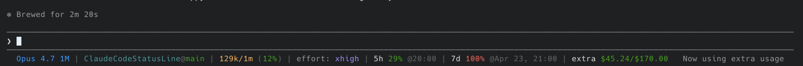

# Claude Code Status Line

> [!note]
> The only change from the original repo is making the status bar two lines.

A custom status line for [Claude Code](https://claude.com/claude-code) that displays model info, token usage, rate limits, and reset times in a single compact line. It runs as an external shell command, so it does not slow down Claude Code or consume any extra tokens.

## Screenshot



## What it shows

| Segment | Description |
|---------|-------------|
| **Model** | Current model name (e.g., Opus 4.6) |
| **CWD@Branch** | Current folder name, git branch, and file changes (+/-) |
| **Tokens** | Used / total context window tokens (% used) |
| **Effort** | Reasoning effort level (low, med, high) |
| **5h** | 5-hour rate limit usage percentage and reset time |
| **7d** | 7-day rate limit usage percentage and reset time |
| **Extra** | Extra usage credits spent / limit (if enabled) |

Usage percentages are color-coded: green (<50%) → yellow (≥50%) → orange (≥70%) → red (≥90%).

## Requirements

### macOS / Linux

- `jq` — for JSON parsing
- `curl` — for fetching usage data from the Anthropic API
- Claude Code with OAuth authentication (Pro/Max subscription)

### Windows

- PowerShell 7+ (for ANSI escape support)
- `git` in PATH (for branch/diff info)
- Claude Code with OAuth authentication (Pro/Max subscription)

## Installation

### Quick setup (recommended)

Copy the contents of `statusline.sh` (or `statusline.ps1` on Windows) and paste it into Claude Code with the prompt:

> Use this script as my status bar

Claude Code will save the script and configure `settings.json` for you automatically.

### Manual setup — macOS / Linux

1. Copy the script to your Claude config directory:

   ```bash
   cp statusline.sh ~/.claude/statusline.sh
   chmod +x ~/.claude/statusline.sh
   ```

2. Add the status line config to `~/.claude/settings.json`:

   ```json
   {
     "statusLine": {
       "type": "command",
       "command": "~/.claude/statusline.sh"
     }
   }
   ```

3. Restart Claude Code.

### Manual setup — Windows

> **Windows users should use `statusline.ps1`** instead of the bash script.

1. Copy the script to your Claude config directory:

   ```powershell
   Copy-Item statusline.ps1 "$env:USERPROFILE\.claude\statusline.ps1"
   ```

2. Add the status line config to `%USERPROFILE%\.claude\settings.json`:

   ```json
   {
     "statusLine": {
       "type": "command",
       "command": "pwsh -NoProfile -File \"%USERPROFILE%\\.claude\\statusline.ps1\""
     }
   }
   ```

3. Restart Claude Code.

## Caching

Usage data from the Anthropic API is cached for 60 seconds at `/tmp/claude/statusline-usage-cache.json` to avoid excessive API calls.

## License

MIT

## Author

Daniel Oliveira

[](https://danielapoliveira.com/)
[](https://x.com/daniel_not_nerd)
[](https://www.linkedin.com/in/daniel-ap-oliveira/)
